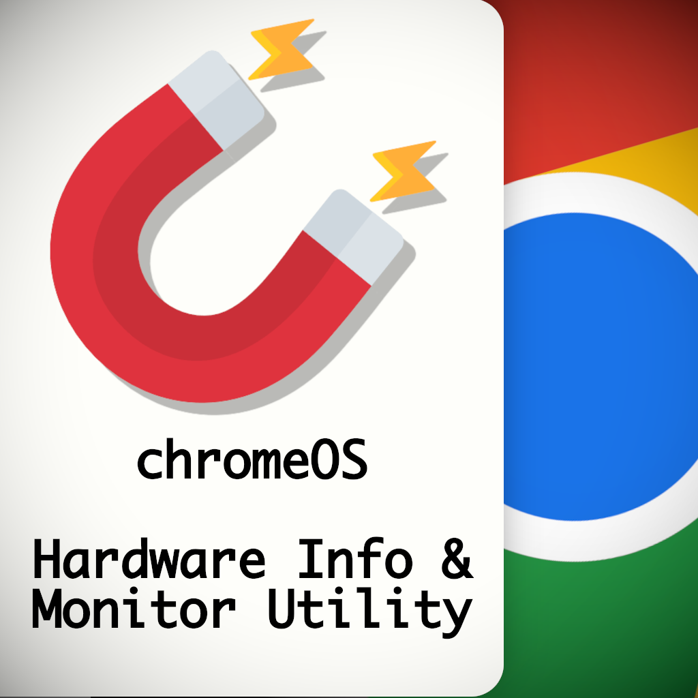

# Hardware Info & Monitor Utility for ChromeOS

This extension allows ChromeOS users to see their hardware details and monitor their hardware usage **without leaving the browser.**

## Browser Compatibility

- Google Chrome & Chromium derivatives

## Availability

Extension is available in .

## Usage

Extension will be accessible upon Google Chrome Web Store approval.

On the other hand, if you want to run the extension locally, follow these steps:

1. Clone the repository (or download the source code)
2. Unpack the extension by going in your browser:
   - Manage Extensions > Turn on Developer Mode > Click "Load Unpacked"
3. Enjoy!
4. If you encounter an error with *"_config.yml"*, just delete it and load the extension.

## Note

This extension is **intended to work in only ChromeOS.** However, you may use it in Linux, MacOS or Windows on any Chromium-based browser if you know what you're doing.

## Frameworks Used

- Fast Bootstrap v2.2.0

## Manifest.json Permissions

- system.cpu
- system.storage
- system.memory
